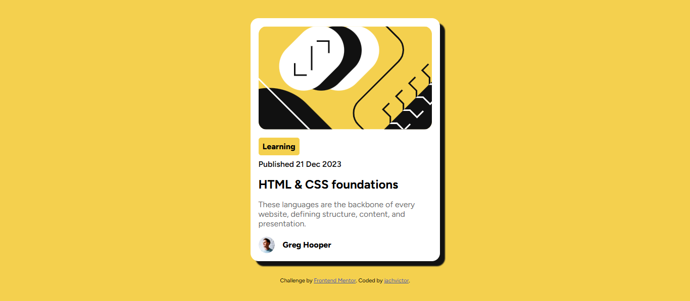

# Frontend Mentor - Blog preview card solution

This is a solution to the [Blog preview card challenge on Frontend Mentor](https://www.frontendmentor.io/challenges/blog-preview-card-ckPaj01IcS). Frontend Mentor challenges help you improve your coding skills by building realistic projects.

## Table of contents

- [Overview](#overview)
  - [The challenge](#the-challenge)
  - [Screenshot](#screenshot)
  - [Links](#links)
- [My process](#my-process)
  - [Built with](#built-with)
  - [What I learned](#what-i-learned)
  - [Continued development](#continued-development)
  - [Useful resources](#useful-resources)
- [Author](#author)
- [Acknowledgments](#acknowledgments)

**Note: Delete this note and update the table of contents based on what sections you keep.**

## Overview

### The challenge

To build a responive block card following a style guide

### Screenshot



**Note: Delete this note and the paragraphs above when you add your screenshot. If you prefer not to add a screenshot, feel free to remove this entire section.**

### Links

- Solution URL: [block-preview-card solution](https://github.com/jachvictor/blog-preview-card)
- Live Site URL: [block-preview-card](https://blog-preview-card-six-iota.vercel.app)

## My process

### Built with

- Semantic HTML5 markup
- CSS custom properties
- Flexbox
- Font files

**Note: These are just examples. Delete this note and replace the list above with your own choices**

### What I learned

During this project, i learned how to apply shadow box to HTML elements, i equally learnt how to use fonts file in my CSS.

```css
@font-face {
  font-family: "Figtree"; /* Your custom font name */
  src: url("../../assets//fonts/Figtree-VariableFont_wght.ttf") format("truetype"); /* Path to the font */
  font-weight: var(--Weight500);
  /* Specify font weight (optional) */
  font-style: normal; /* Specify font style (optional) */
}
@font-face {
  font-family: "FigtreeExtraBold"; /* Your custom font name */
  src: url("../../assets//fonts/static/Figtree-ExtraBold.ttf") format("truetype"); /* Path to the font */
  font-weight: var(--Weight800);
  /* Specify font weight (optional) */
  font-style: normal; /* Specify font style (optional) */
}

.wrap-block {
  display: flex;
  flex-wrap: wrap;
  justify-content: center;
  gap: 1rem;
  flex-direction: column;
  flex-wrap: wrap;
  width: 375px;
  background-color: var(--White);
  padding: 1rem;
  border-radius: 1rem;
  box-shadow: 10px 10px 2px var(--Gray950);
}
```

**Note: Delete this note and the content within this section and replace with your own learnings.**

### Continued development

my focus area in future project are:

- Using more css variable to write shorter codes
- perfecting my use of semantic HTML

**Note: Delete this note and the content within this section and replace with your own plans for continued development.**

### Useful resources

- [MDN Web Docs - Semantic HTML](https://developer.mozilla.org/en-US/docs/Web/HTML) - Helped me understand the importance of semantic tags.
- [CSS Tricks - A Complete Guide to Flexbox](https://web.dev) - his guide was essential for laying out the components.
- [Google Fonts](https://fonts.google.com/) - Provided easy integration of custom fonts.

**Note: Delete this note and replace the list above with resources that helped you during the challenge. These could come in handy for anyone viewing your solution or for yourself when you look back on this project in the future.**

## Author

- Website - [jachvictor](https://cipherskill.vercel.app)
- Frontend Mentor - [@jachvictor](https://www.frontendmentor.io/profile/jachvictor)
- Twitter - [@jachvictor](https://www.twitter.com/jachvictor10)

**Note: Delete this note and add/remove/edit lines above based on what links you'd like to share.**

## Acknowledgments

Thanks to the Frontend Mentor community for their support and feedback on this project!

**Note: Delete this note and edit this section's content as necessary. If you completed this challenge by yourself, feel free to delete this section entirely.**
